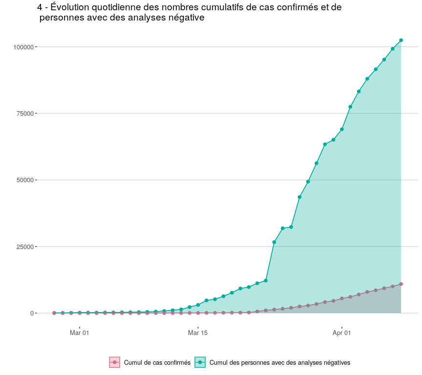
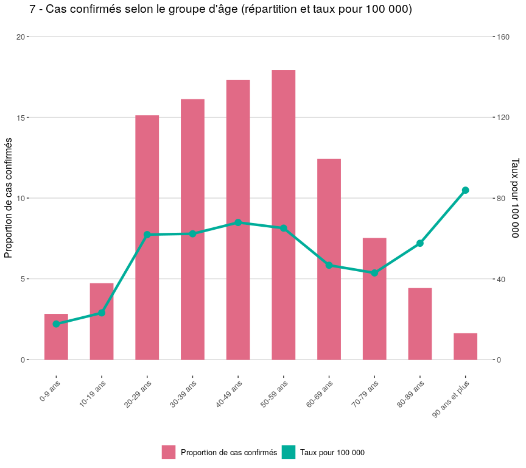

# Load Required Packages {-}


```r
pacman::p_load(jsonlite)
pacman::p_load(tidyverse)
pacman::p_load(lubridate)
pacman::p_load(colorspace)
pacman::p_load(ggthemes)
```


# 1- Évolution quotidienne des nouveaux cas et du nombre cumulatif de cas liés à la COVID-19 au Québec {-}


```r
# Data cleaning -----------------------------------------------------------

graph1 <- fromJSON("https://spreadsheets.google.com/feeds/cells/1kmCbHvJFHe70GZNqOTP-sHjYDvJ_pa7zn2-gJhCNP3g/1/public/values?alt=json")

ds1 <- graph1$feed$entry$`gs$cell`
# need to add missing row for march 3 for nouveaux cas
ds1 <- rbind(ds1[1:5, ], c(2, 3, 0, 0), ds1[-(1:5), ])

DT1 <- ds1[-c(1:3), ] %>%
  mutate(
    row = as.numeric(as.character(row)),
    col = as.numeric(as.character(col))
  ) %>%
  rename(value = `$t`)

DT1 <- DT1 %>%
  mutate(
    type = rep(ds1$`$t`[1:3], max(DT1$row) - 1),
    ID = rep(seq_len(max(DT1$row) - 1), each = 3)
  ) %>%
  dplyr::select(-row, -col, -numericValue) %>%
  pivot_wider(names_from = type, values_from = value) %>%
  mutate(
    Date = lubridate::as_date(dmy(Date)),
    `Nombre cumulatif de cas` = as.numeric(`Nombre cumulatif de cas`),
    `Nouveaux cas` = as.numeric(`Nouveaux cas`)
  ) %>%
  pivot_longer(
    cols = c(-ID, -Date),
    names_to = "type"
  ) %>%
  mutate(value = ifelse(value == 0, NA, value))

readr::write_csv(DT1, path = here::here(sprintf("data/cumulative_cases_QC_%s.csv", max(DT1$Date))))
```


```r
# Plot  -------------------------------------------------------------------

dates <- unique(filter(DT1, type == "Nombre cumulatif de cas")$Date)

ggplot() +
  geom_line(
    data = filter(DT1, type == "Nombre cumulatif de cas"),
    mapping = aes(x = Date, y = value, color = type)
  ) +
  geom_point(
    data = filter(DT1, type == "Nombre cumulatif de cas"),
    mapping = aes(x = Date, y = value, color = type, fill = type),
    size = 2, pch = 21
  ) +
  geom_col(
    data = filter(DT1, type == "Nouveaux cas"),
    mapping = aes(x = Date, y = value, color = type, fill = type),
    width = 0.5
  ) +
  ggthemes::theme_hc() +
  # ylim(c(0, 350)) +
  scale_y_continuous(breaks = seq(0, 6000, 1000), limits = c(0, 6000)) +
  scale_x_date(date_breaks = "1 day", date_labels = "%b %d") +
  theme(
    legend.position = "bottom",
    legend.title = element_blank(),
    axis.text.x = element_text(angle = 45, hjust = 1)
  ) +
  colorspace::scale_fill_discrete_qualitative() +
  colorspace::scale_color_discrete_qualitative() +
  labs(title = "1 - Évolution quotidienne des nouveaux cas et du nombre cumulatif de cas liés à la \nCOVID-19 au Québec") +
  xlab("") +
  ylab("")
```

<!-- -->


# 2 - Évolution quotidienne des décès et du nombre cumulatif de décès liés à la COVID-19 au Québec {-}


```r
# Data cleaning -----------------------------------------------------------

graph2 <- fromJSON("https://spreadsheets.google.com/feeds/cells/1kmCbHvJFHe70GZNqOTP-sHjYDvJ_pa7zn2-gJhCNP3g/2/public/values?alt=json")


ds2 <- graph2$feed$entry$`gs$cell`
# need to add missing row for march 18 for nouveaux deces
ds2 <- rbind(ds2[1:5, ], c(2, 3, 0, 0), ds2[-(1:5), ])

DT2 <- ds2[-c(1:3), ] %>%
  mutate(
    row = as.numeric(as.character(row)),
    col = as.numeric(as.character(col))
  ) %>%
  rename(value = `$t`)

DT2 <- DT2 %>%
  mutate(
    type = rep(ds2$`$t`[1:3], max(DT2$row) - 1),
    ID = rep(seq_len(max(DT2$row) - 1), each = 3)
  ) %>%
  dplyr::select(-row, -col, -numericValue) %>%
  pivot_wider(names_from = type, values_from = value) %>%
  mutate(
    Date = lubridate::as_date(dmy(Date)),
    `Nombre cumulatif de décès` = as.numeric(`Nombre cumulatif de décès`),
    `Nouveaux décès` = as.numeric(`Nouveaux décès`)
  ) %>%
  pivot_longer(
    cols = c(-ID, -Date),
    names_to = "type"
  ) %>%
  mutate(value = ifelse(value == 0, NA, value))
```


```r
# Plot --------------------------------------------------------------------

dates <- unique(filter(DT2, type == "Nombre cumulatif de décès")$Date)

ggplot() +
  geom_line(
    data = filter(DT2, type == "Nombre cumulatif de décès"),
    mapping = aes(x = Date, y = value, color = type)
  ) +
  geom_point(
    data = filter(DT2, type == "Nombre cumulatif de décès"),
    mapping = aes(x = Date, y = value, color = type, fill = type),
    size = 2, pch = 21
  ) +
  geom_col(
    data = filter(DT2, type == "Nouveaux décès"),
    mapping = aes(x = Date, y = value, color = type, fill = type),
    width = 0.5
  ) +
  ggthemes::theme_hc() +
  scale_y_continuous(breaks = seq(0, 40, 10), limits = c(0, 40)) +
  scale_x_date(date_breaks = "1 day", date_labels = "%b %d") +
  theme(
    legend.position = "bottom",
    legend.title = element_blank(),
    axis.text.x = element_text(angle = 45, hjust = 1)
  ) +
  colorspace::scale_fill_discrete_qualitative() +
  colorspace::scale_color_discrete_qualitative() +
  labs(title = "2 - Évolution quotidienne des décès et du nombre cumulatif de décès liés à la COVID-19 au Québec") +
  xlab("") +
  ylab("")
```

<!-- -->

```r
readr::write_csv(DT2, path = here::here(sprintf("data/cumulative_deaths_QC_%s.csv", max(DT1$Date))))
```


# 3 - Évolution quotidienne du nombre d'hospitalisations liées à la COVID-19 au Québec {-}


```r
# Data cleaning -----------------------------------------------------------
graph3 <- fromJSON("https://spreadsheets.google.com/feeds/cells/1kmCbHvJFHe70GZNqOTP-sHjYDvJ_pa7zn2-gJhCNP3g/3/public/values?alt=json")

ds3 <- graph3$feed$entry$`gs$cell`
DT3 <- ds3[-c(1:3), ] %>%
  mutate(
    row = as.numeric(as.character(row)),
    col = as.numeric(as.character(col))
  ) %>%
  rename(value = `$t`)

DT3 <- DT3 %>%
  mutate(
    type = rep(ds3$`$t`[1:3], max(DT3$row) - 1),
    ID = rep(seq_len(max(DT3$row) - 1), each = 3)
  ) %>%
  dplyr::select(-row, -col, -numericValue) %>%
  pivot_wider(names_from = type, values_from = value) %>%
  mutate(
    Date = lubridate::as_date(dmy(Date)),
    `Hospitalisations` = as.numeric(`Hospitalisations`),
    `Soins intensifs` = as.numeric(`Soins intensifs`)
  ) %>%
  pivot_longer(
    cols = c(-ID, -Date),
    names_to = "type"
  )
```


```r
# Plot --------------------------------------------------------------------

dates <- unique(filter(DT3, type == "Hospitalisations")$Date)

ggplot() +
  geom_line(
    data = filter(DT3, type == "Hospitalisations"),
    mapping = aes(x = Date, y = value, color = type)
  ) +
  geom_point(
    data = filter(DT3, type == "Hospitalisations"),
    mapping = aes(x = Date, y = value, color = type, fill = type),
    size = 2, pch = 21
  ) +
  geom_area(
    data = filter(DT3, type == "Hospitalisations"),
    mapping = aes(x = Date, y = value, color = type, fill = type),
    position = "identity", alpha = 0.3
  ) +
  geom_col(
    data = filter(DT3, type == "Soins intensifs"),
    mapping = aes(x = Date, y = value, color = type, fill = type),
    width = 0.5
  ) +
  ggthemes::theme_hc() +
  scale_y_continuous(breaks = seq(0, 400, 50), limits = c(0, 400)) +
  scale_x_date(date_breaks = "1 day", date_labels = "%b %d") +
  theme(
    legend.position = "bottom",
    legend.title = element_blank(),
    axis.text.x = element_text(angle = 45, hjust = 1)
  ) +
  colorspace::scale_fill_discrete_qualitative() +
  colorspace::scale_color_discrete_qualitative() +
  labs(title = "3 - Évolution quotidienne du nombre d'hospitalisations liées à la COVID-19 au Québec") +
  xlab("") +
  ylab("")
```

<!-- -->

```r
readr::write_csv(DT3, path = here::here(sprintf("data/cumulative_hospitalisations_QC_%s.csv", max(DT1$Date))))
```


# 4 - Évolution quotidienne des nombres cumulatifs de cas confirmés et de personnes avec des analyses négative {-}


```r
# Data cleaning -----------------------------------------------------------

graph4 <- fromJSON("https://spreadsheets.google.com/feeds/cells/1kmCbHvJFHe70GZNqOTP-sHjYDvJ_pa7zn2-gJhCNP3g/4/public/values?alt=json")

ds4 <- graph4$feed$entry$`gs$cell`
DT4 <- ds4[-c(1:3), ] %>%
  mutate(
    row = as.numeric(as.character(row)),
    col = as.numeric(as.character(col))
  ) %>%
  rename(value = `$t`)

DT4 <- DT4 %>%
  mutate(
    type = rep(ds4$`$t`[1:3], max(DT4$row) - 1),
    ID = rep(seq_len(max(DT4$row) - 1), each = 3)
  ) %>%
  dplyr::select(-row, -col, -numericValue) %>%
  pivot_wider(names_from = type, values_from = value) %>%
  mutate(
    Date = lubridate::as_date(dmy(Date)),
    `Cumul des personnes avec des analyses négatives` = as.numeric(`Cumul des personnes avec des analyses négatives`),
    `Cumul de cas confirmés` = as.numeric(`Cumul de cas confirmés`)
    # `Sous investigation` = as.numeric(`Sous investigation`)
  ) %>%
  pivot_longer(
    cols = c(-ID, -Date),
    names_to = "type"
  )
```


```r
# Plot --------------------------------------------------------------------

DT4 %>%
  filter(type %in% c("Cumul des personnes avec des analyses négatives", "Cumul de cas confirmés")) %>%
  ggplot(mapping = aes(x = Date, y = value, color = type, fill = type)) +
  geom_line() +
  geom_point(size = 2, pch = 21) +
  geom_area(position = "identity", alpha = 0.3) +
  ggthemes::theme_hc() +
  ylim(c(0, 80000)) +
  theme(legend.position = "bottom", legend.title = element_blank()) +
  colorspace::scale_fill_discrete_qualitative() +
  colorspace::scale_color_discrete_qualitative() +
  labs(title = "4 - Évolution quotidienne des nombres cumulatifs de cas confirmés et de\n personnes avec des analyses négative") +
  xlab("") +
  ylab("")
```

<!-- -->

```r
readr::write_csv(DT4, path = here::here(sprintf("data/cumulative_case_and_negatives_QC_%s.csv", max(DT1$Date))))
```


# 7 - Cas confirmés selon le groupe d'âge (répartition et taux pour 100 000) {-}


```r
# Data cleaning -----------------------------------------------------------

graph7 <- fromJSON("https://spreadsheets.google.com/feeds/cells/1kmCbHvJFHe70GZNqOTP-sHjYDvJ_pa7zn2-gJhCNP3g/6/public/values?alt=json")

ds7 <- graph7$feed$entry$`gs$cell`

DT7 <- ds7[-c(1:3), ] %>%
  mutate(
    row = as.numeric(as.character(row)),
    col = as.numeric(as.character(col))
  ) %>%
  rename(value = `$t`)

DT7 <- DT7 %>%
  mutate(
    type = rep(ds7$`$t`[1:3], max(DT7$row) - 1),
    ID = rep(seq_len(max(DT7$row) - 1), each = 3)
  ) %>%
  dplyr::select(-row, -col, -numericValue) %>%
  pivot_wider(names_from = type, values_from = value) %>%
  mutate(
    `Proportion de cas confirmés` = as.numeric(`Proportion de cas confirmés`),
    `Taux pour 100 000` = as.numeric(`Taux pour 100 000`)
  ) %>%
  pivot_longer(
    cols = c(-ID, -`Groupe d'âge`),
    names_to = "type"
  )


readr::write_csv(DT7, path = here::here(sprintf("data/cases_by_age_QC_%s.csv", max(DT1$Date))))
```


```r
# Plot --------------------------------------------------------------------

ggplot() +
  geom_col(
    data = filter(DT7, type == "Proportion de cas confirmés"),
    mapping = aes(x = `Groupe d'âge`, y = value, color = type, fill = type),
    width = 0.5
  ) +
  ggthemes::theme_hc() +
  scale_y_continuous("Proportion de cas confirmés",
    breaks = seq(0, 20, 5),
    limits = c(0, 20),
    sec.axis = sec_axis(~ . * 8,
      name = "Taux pour 100 000",
      breaks = seq(0, 160, 40)
    )
  ) +
  theme(
    legend.position = "bottom",
    legend.title = element_blank(),
    axis.text.x = element_text(angle = 45, hjust = 1)
  ) +
  labs(title = "7 - Cas confirmés selon le groupe d'âge (répartition et taux pour 100 000)") +
  xlab("") +
  ylab("") +
  geom_point(
    data = filter(DT7, type == "Taux pour 100 000"),
    mapping = aes(x = `Groupe d'âge`, y = value / 8, color = type, fill = type),
    pch = 21, size = 3.5
  ) +
  geom_path(
    data = filter(DT7, type == "Taux pour 100 000"),
    mapping = aes(x = `Groupe d'âge`, y = value / 8, color = type, group = type),
    size = 1.5
  ) +
  colorspace::scale_fill_discrete_qualitative() +
  colorspace::scale_color_discrete_qualitative()
```

<!-- -->


```r
knitr::knit_exit()
```


